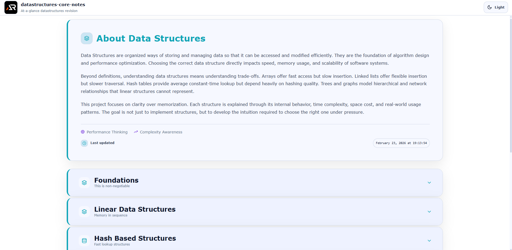

# Data Structures Core Notes

A single-page, at-a-glance revision project for core data structures and algorithmic thinking.

This project is designed as a fast reference and structured summary sheet covering essential data structure concepts without unnecessary depth.  
It focuses on clarity, time and space trade-offs, real-world usage, and interview-ready fundamentals.

---



---

## Purpose

- Quick revision before interviews
- Rapid recall of core data structures and patterns
- Strong mental model of time complexity and space complexity
- Practical, decision-driven reminders for choosing the right structure
- Clear implementations mindset (primary C++ focus, concept-first notes)

## Coverage

### Foundations

- What is a data structure
- Abstract Data Type (ADT) vs data structure
- Time complexity and Big O
- Space complexity
- Worst-case vs average-case thinking
- Amortized analysis basics
- Common trade-offs (speed vs memory)

### Linear Data Structures

- Arrays (static vs dynamic)
- Vectors and resizing concept
- Linked list (singly, doubly, circular)
- Stack
- Queue
- Deque

### Hash Based Structures

- Hash table fundamentals
- Hash functions and collisions
- Collision resolution (chaining, open addressing concepts)
- Load factor and rehashing
- Set vs Map

### Trees

- Tree basics and terminology
- Binary tree
- Binary search tree
- Traversals (DFS, BFS)
- Balanced tree concept (intro)
- Heap (min heap, max heap)
- Priority queue

### Graphs

- Graph fundamentals
- Directed vs undirected
- Weighted vs unweighted
- Graph representations (adjacency list, adjacency matrix)
- BFS and DFS
- Cycle detection concept
- Topological sort concept
- Shortest path idea (intro)

### Advanced Structures

- Trie
- Disjoint set (Union Find)
- Segment tree (concept level)
- Fenwick tree (intro level)

### Algorithmic Patterns

- Two pointers
- Sliding window
- Fast and slow pointers
- Binary search pattern
- Divide and conquer concept
- Recursion basics and stack cost
- Backtracking concept
- Greedy basics
- Dynamic programming intro

### Complexity Master Section

- Time vs space trade-offs
- Cache locality intuition
- Worst case traps and when Big O lies
- Common performance mistakes

## Tech Stack

- React
- Vite
- styled-components

## Project Type

Single page only  
Section-based navigation  
Searchable and expandable content  
No blog-style content, only structured notes

Each section is modular and collapsible for fast scanning.

## Run Locally

```bash
npm install
npm run dev
```

## Goal

Complete data structures fundamentals in one scrollable page.
No fluff. No repetition. Just essentials.
